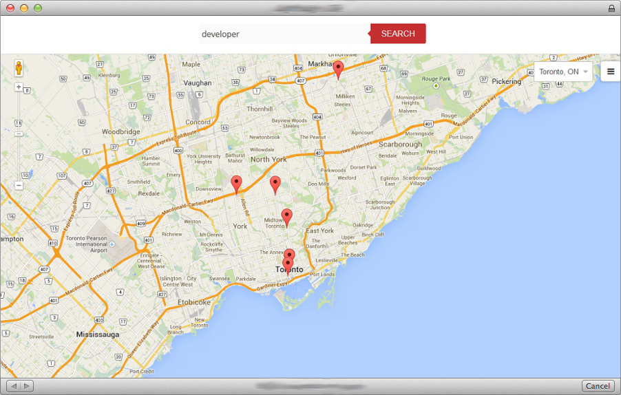
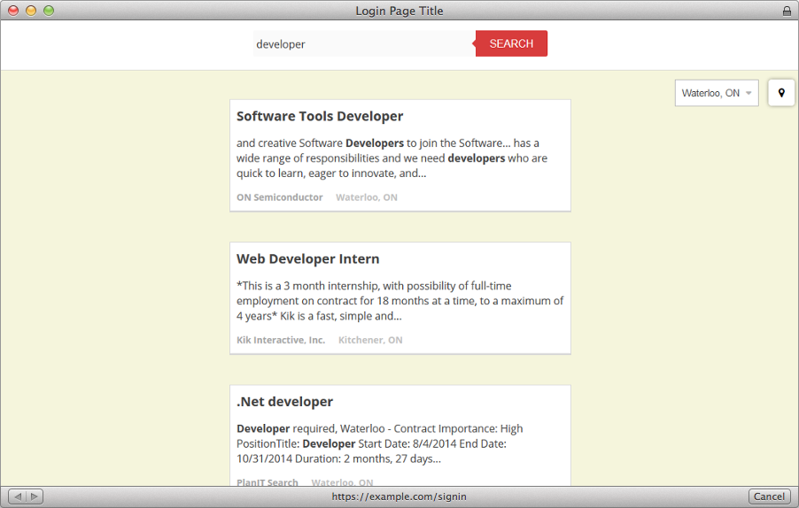

internpin
=========

Interpin is an xcercise into AngularJS, Node and Google Maps. In order to test it requires an Indeed API Key. 

## Getting Started

### Requirements 

Before getting started there are some things that you require: 

* Indeed.ca API key
* NodeJS installed

### Cloning and Dependencies

Start by cloning the repo.

	git clone https://github.com/karanbirrandhawa/interpin

Next install the npm modules

	npm install

Now go to the AngularJS app and get its frontend dependencies

	cd app
	bower install

### Run it!

	PUBLISHER=MY_INDEED_API_KEY_HERE node server.js

If you want to make these changes permanent you can to to server/controllers/job.js and edit the line that says "API_KEY_HERE" to include your key and remove the environment reference. Before:

	// Indeed api key
	var api_key = process.env.PUBLISHER || "YOUR_API_KEY_HERE"

After:

	// Indeed api key
	var api_key = "1234567890123" // example key #

### Check it out 

The application shoul now be running on localhost:3000.

### Bugs and Todo

* Fix error on job loading that prevents switching job queries from reloading map markers
* Add map marker preview 